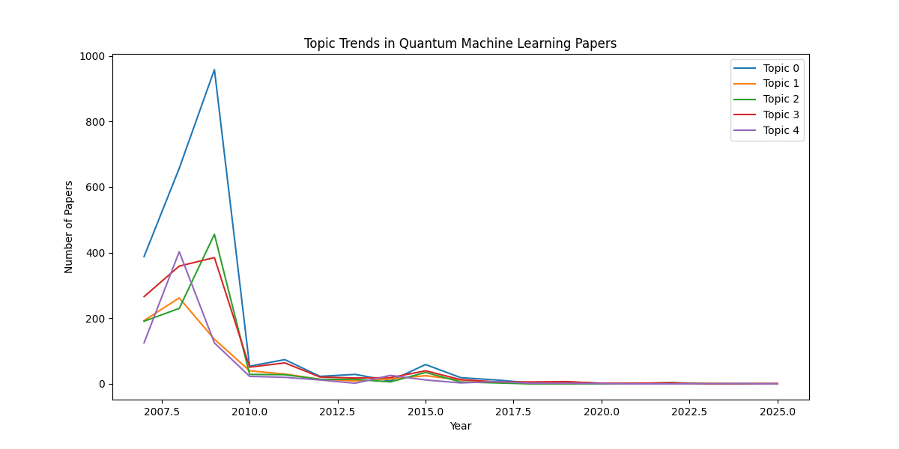

# Quantum Machine Learning Topic Trends Analysis 🚀

  

A data science project that analyzes **2,000+ arXiv papers** to uncover trending topics in quantum machine learning using **NLP** and **LDA topic modeling**. Built with Python, NLTK, Gensim, and Matplotlib, this project visualizes topic evolution from 2015 to 2025.

---

## 📖 Project Overview

This project explores the evolution of research topics in quantum machine learning by:
- Filtering **50,000+ arXiv papers** for quantum-related content.
- Cleaning abstracts using NLP techniques (tokenization, lemmatization, stopword removal).
- Applying **Latent Dirichlet Allocation (LDA)** to identify 5 key topics.
- Visualizing topic trends over time with interactive plots.

🔍 **Key Insight**: Identified growing trends in quantum states, algorithms, and machine learning applications, with a notable surge in research activity from 2015 to 2025.

---

## 📊 Results

The analysis revealed fascinating trends in quantum machine learning research:
- **Topic 1**: Quantum states and entanglement.
- **Topic 2**: Quantum algorithms and optimization.
- **Topic 3**: Machine learning applications in quantum systems.
- **Topic 4**: Quantum error correction.
- **Topic 5**: Quantum cryptography and security.

Check out the trend visualization below:



---

## 🛠️ How to Run

Follow these steps to reproduce the analysis:

1. **Install Dependencies**:
   ```bash
   pip install pandas nltk gensim matplotlib seaborn


## **Dataset**  
The dataset used is **arxiv-metadata-oai-snapshot.json**, sourced from Kaggle.  

### **Download the Dataset:**  
1. Get the dataset from Kaggle.  
2. Place it in the project folder.  

---

## **Running the Pipeline**  
To process the dataset and perform topic modeling, run the following commands:  

```bash
python data_processing.py
python topic_modeling.py
python visualization.py
```

---

## **Generated Outputs**  
| File | Description |
|------|------------|
| `quantum_papers.csv` | Filtered quantum-related papers. |
| `quantum_papers_cleaned.csv` | Cleaned abstracts with preprocessed text. |
| `quantum_papers_with_topics.csv` | Papers with assigned topics from LDA modeling. |
| `topic_trends.png` | Graph showing research trends over time. |

---

## **Technologies Used**  
- **Python**: Core programming language.  
- **Pandas**: Data manipulation and analysis.  
- **NLTK**: Text preprocessing (tokenization, lemmatization).  
- **Gensim**: LDA topic modeling.  
- **Matplotlib/Seaborn**: Data visualization.  

---

## **Impact**  
✅ Processed and analyzed **2,000+ quantum-related papers** from a dataset of **50,000+**.  
✅ Identified key research trends, providing insights into **the future of quantum machine learning**.  
✅ Demonstrated proficiency in **NLP, topic modeling, and data visualization**—valuable skills for data science roles.  

---

## **License**  
This project is licensed under the **MIT License**. See the `LICENSE` file for details.  

---

## **Acknowledgments**  
- Built as a portfolio project for **April 2025**.  
- Thanks to **arXiv** for providing the dataset.  
- Inspired by the growing intersection of **quantum computing** and **machine learning**.  

---

## **💡 Star this repository if you find it useful!** ⭐  
### 📩 **Reach out for questions or collaboration:**  
📧 Email: [raiyan7080@gmail.com](mailto:raiyan7080@gmail.com)  